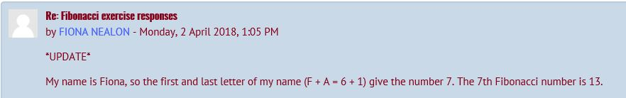
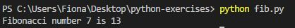
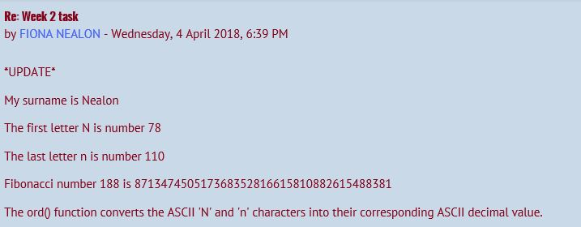
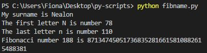
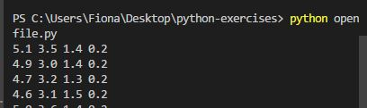
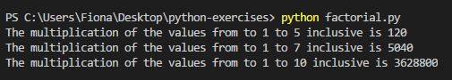

# Index of solutions to exercises in python-exercises repository

1. fib.py - Solution to exercise 1
2. fibname.py - Solution to exercise 2
3. collatz.py - Solution to exercise 3
4. euler5.py - Solution to exercise 4
5. iris.py - Solution to exercise 5
6. factorial.py - Solution to exercise 6

# Exercise 1
Please complete the following exercise this week. In the video lectures this week we ran an example program that calculated the 30th Fibonacci number. Change the program to calculate the nth Fibonacci number where n the sum of the first and last letters of your first name as numbers. Take A as the number 1, B as 2, C as 3, and so on. For example, my name is Ian, so I should calculate the 25th Fibonacci number because I is 9 and n is 14, giving 25 in total. Once you calculate the right Fibonacci number for your own name, please post it to the Discussions forum on this page as per my post there.

## References
Wikipedia contributors. "Fibonacci Number." Wikipedia, The Free Encyclopedia. Wikipedia, The Free Encyclopedia, 28 Mar. 2018. Web. 28 Mar. 2018.< https://en.wikipedia.org/wiki/Fibonacci_number

IPython Software Foundation. The Python Tutorial, Python 3.6.5 documentation. Available at https://docs.python.org/3/tutorial/

Python Software Foundation. Python Language Reference, version 2.7. Available at http://www.python.org

## Answer to Exercise 1
My name is Fiona, so the first and last letter of my name (F + A = 6 + 1) give the number 7. The 7th Fibonacci number is 13. 


## Introduction
A Fibonacci number sequence is a sequence of numbers where the first two Fibonacci numbers are 0 and 1. The next Fibonacci number is the sum of the previous 2 Fibonacci numbers. 
The 7th Fibonacci number in the Fibonacci number sequence = 13 (0 1 1 2 3 5 8 13)

## Analysis and discussion of Exercise 1

The function fib calculates the 7th Fibonacci number using a while loop. 

A while loop in python programming repeatedly executes a target statement as long as a given condition is true. In this case, the while loop repeatedly executes a multiple assignment statement as long as n > 0.

In the multiple assignment, all values on the right side of the ‘=‘are calculated first and then assigned to the variables on the left side of the ‘=‘. For example, the first time through the loop the values for i and j are as follows:
```python
i = 0
j = 1
```
When they reach the multiple assignment, you can substitute these values for the variables and see the new values for i and j:
```python
i, j = 1, 0 + 1
```
So now:
```python
i = 1
j = 1
```
In the next iteration of the loop (2):
```python
i, j = 1, 1 + 1
```
so now: 
```python
i = 1
j = 2
```
In the next iteration of the loop (3):
```python
i, j = 2, 1 + 2
```
so now: 
```python
i = 2
j = 3
```
In the next iteration of the loop (4):
```python
i, j = 3, 2 + 3
```
so now: 
```python
i = 3
j = 5
```
In the next iteration of the loop (5):
```python
i, j = 5, 3 + 5
```
so now: 
```python
i = 5
j = 8
```
In the next iteration of the loop (6):
```python
i, j = 8, 5 + 8
```
so now: 
```python
i = 8
j = 13
```
In the next iteration of the loop (7):
```python
i, j = 13, 8 + 13
```
so now: 
```python
i = 13
j = 21
```
The most important variable is i as it is the one that is returned at the end of the function. You can see that the 7 times that we’ve gone through the loop the value of i has been set to a number from the sequence:

0, 1, 1, 2, 3, 5, 8, 13

In the while loop the reason that you have n = n - 1  is to act as a counter. Every time we go through the loop, n is de-incremented by 1 so if n = 7 the first time through the loop, it becomes 6 the next time through and so on until it becomes -1, which then fails the condition of the while loop (n >= 0) and the while loop ends.

After the while loop ends, the next line is the last line of the function:
```python
return i
```
This line returns the last value of i which was generated in the while loop.

Everything up to this point has been discussing the contents of the function fib.

The next part is not part of the function:
```python
x = 7
ans = fib(x)
print("Fibonacci number", x, "is", ans)
```

So…
x = 7 assigns the value of 7 to x.
```python
ans = fib(x)
```
Since x = 7, this can be written:
```python
ans = fib(7)
```
What this line is doing, is calling the function fib with an argument of 7 and when we look at the definition of fib, def fib(n):, what you can see is that the initial n value of the function is being set to 7. What happens now, is that the function does it’s work, looping 7 times and setting the value of i each time through the loop and when the loop is finished it returns the value of i. It is this value that is assigned to ans.
The last line:
```python
print("Fibonacci number", x, "is", ans)
```

This prints:

"Fibonacci number”, then the value of x, then “is” and then the value of ans.
In this case, since x is 7 then it prints:

Fibonacci number 7 is 13

## How to run this code:

1. Download [Anaconda](https://anaconda.org/).
2. Install Anaconda
3. Download [Visual Studio Code](https://code.visualstudio.com/download).
4. Install Visual Studio Code
5. Save a new folder on desktop e.g. Python Exercises
6. Save fib.py file into this folder
7. Open Visual Studio Code
8. Open Python Exercises folder from desktop
9. Open fib.py file
10.	Open integrated terminal in Visual Studio code (Crtl + ')
11. Type ‘python fib.py’ in the command prompt in the terminal
12.	Press enter

## Result:



# Exercise 2

https://github.com/ianmcloughlin/python-fib/blob/master/fibname.py

Above is a link to a program I wrote that works similarly to last week's exercise. Copy and run the program yourself. Change the string variable to contain your own surname, and rerun it. Can you figure out what ord() does? Try to Google it to find out. Post the output of the program, along with any insight you have as to what ord() does, to the discussions forum.

## References

Wikipedia contributors. "ASCII" Wikipedia, The Free Encyclopedia. Wikipedia, The Free Encyclopedia, 24 Mar. 2018. Web. 24 Mar. 2018.< https://en.wikipedia.org/wiki/ASCII

Wikipedia contributors. "Fibonacci Number." Wikipedia, The Free Encyclopedia. Wikipedia, The Free Encyclopedia, 28 Mar. 2018. Web. 28 Mar. 2018.< https://en.wikipedia.org/wiki/Fibonacci_number

Python Software Foundation. The Python Tutorial, Python 3.6.5 documentation. Available at https://docs.python.org/3/tutorial/

Python Software Foundation. Python Language Reference, version 2.7. Available at http://www.python.org

## Answer to Exercise 2

My surname is Nealon

The first letter N is number 78

The last letter n is number 110

Fibonacci number 188 is 871347450517368352816615810882615488381

The ord() function converts the ASCII 'N' and 'n' characters into their corresponding ASCII decimal value.



## Introduction

This program displays Fibonacci numbers using a person's name. A Fibonacci number sequence is a sequence of numbers where the first two Fibonacci numbers are 0 and 1. The next Fibonacci number is the sum of the previous 2 Fibonacci numbers. The sequence continues until the required Fibonaaci number is reached.

The program locates the first letter and the last letter of the person's name and converts these letters (ASCII characters) in decimal. The program then adds these two decimal numbers together and provides a desciption of this process in the terminal.


## Analysis and discussion of Exercise 2

This program is similar to the program in Exercise 1. In this program, the while loop also repeatedly executes a multiple assignment statement as long as n > 0.

To find the value n:
```python
name = "Nealon"
first = name[0]
last = name[-1]
firstno = ord(first)
lastno = ord(last)
x = firstno + lastno
```
This program finds the first letter and the last letter of the name "Nealon" - "N and "n" using [0] amd [-1] - the first and last elements of the list. The ord() function then converts the 'N' and 'n'  ASCII characters into decimal values so "N"=78 and "n"=110. On the next line, 78 and 110 are then added together to assign the value of x.
```python
ans = fib(x)
```
Since x = 188, this can be written:
```python
ans = fib(188)
```
This line is calling the function fib with an argument of 188 and if we look at the definition of fib, def fib(n):, what you can see is that the initial n value of the function is being set to 188. What happens now is that the function does it’s work, looping 188 times and setting the value of i each time through the loop and when the loop is finished it returns the value of i. 

See below details on fib(188):

In the multiple assignment of the while loop, all values on the right side of the ‘=‘are calculated first and then assigned to the variables on the left side of the ‘=‘. For example, the first time through the loop the values for i and j are as follows:
```python
i = 0
j = 1
```
When they reach the multiple assignment, you can substitute these values for the variables and see the new values for i and j:
```python
i, j = 1, 0 + 1
```
So now:
```python
i = 1
j = 1
```
In the next iteration of the loop (2):
```python
i, j = 1, 1 + 1
```
so now: 
```python
i = 1
j = 2
```
In the next iteration of the loop (3):
```python
i, j = 2, 1 + 2
```
so now: 
```python
i = 2
j = 3
```
This continues until the 188th iteration of the loop after which n becomes -1 which then fails the condition of the while loop (n >= 0) and the while loop ends. n = n - 1  is to act as a counter for this iteration.
```python
i, j = 871347450517368352816615810882615488381, 538522340430300790495419781092981030533 + 871347450517368352816615810882615488381
```
so now: 
```python
i = 871347450517368352816615810882615488381
j = 1409869790947669143312035591975596518914
```
After the while loop ends, the next line is the last of the function:
```python
return i
```
This line returns the last value of i which was generated in the while loop.

```python
ans = fib(x)
print("My surname is", name)
print("The first letter", first, "is number", firstno)
print("The last letter", last, "is number", lastno)
print("Fibonacci number", x, "is", ans)
```
This prints:
"My surname is”, then the name (line 16 of the program) on the first sentence at the command prompt. 

In this case, since name is Nealon then it prints:

My surname is Nealon

"The first letter", then then the value of first (line 17 of the program,) then "is number", then the value of firstno (line 19 of the program) on the second sentence at the command prompt. 

In this case, since first is N and firstno is 78 it prints:

The first letter N is number 78

"The last letter", then then the value of last (line 18 of the program,) then "is number", then the value of lastno (line 20 of the program) on the third sentence at the command prompt. 

In this case, since last is n and firstno is 110 it prints:

The last letter n is number 110

"Fibonacci number”, then the value of x, then “is” and then the value of ans.

In this case, since x is 188 then it prints:

Fibonacci number 188 is 871347450517368352816615810882615488381

## How to run this code:

1. Download [Anaconda](https://anaconda.org/).
2. Install Anaconda
3. Download [Visual Studio Code](https://code.visualstudio.com/download).
4. Install Visual Studio Code
5. Save a new folder on desktop e.g. Python Exercises
6. Save fib.py file into this folder
7. Open Visual Studio Code
8. Open Python Exercises folder from desktop
9. Open fibname.py file
10.	Open integrated terminal in Visual Studio code (Crtl + ')
11. Type ‘python fibname.py’ in the command prompt in the terminal
12.	Press enter

 ## Result:




## Exercise 3

Please complete the following exercise this week. In the video lectures we discussed the Collatz conjecture. Complete the exercise discussed in the Collatz conjecture video by writing a single Python script that starts with an integer and repeatedly applies the Collatz function (divide by 2 if even, multiply by three and 1 if odd) using a while loop and if statement. At each iteration, the current value of the integer should be printed to the screen. You can specify in your code the starting value of 17. If you wish to enhance your program, have the program ask the user for the integer instead of specifying a value at the start of your code. Add the script to your GitHub repository, as per the instruction in the Assessments section.


## References

Wikipedia contributors. "Collatz conjecture." Wikipedia, The Free Encyclopedia. Wikipedia, The Free Encyclopedia, 29 Mar. 2018. Web. 29 Mar. 2018.< https://en.wikipedia.org/wiki/Collatz_conjecture

Python Software Foundation. The Python Tutorial, Python 3.6.5 documentation. Available at https://docs.python.org/3/tutorial/

Python Software Foundation. Python Language Reference, version 2.7. Available at http://www.python.org

## Answer to Exercise 3

Please enter an integer: 17
52
26
13
40
20
10
5
16
8
4
2
1


## Introduction

The collatz conjecture is defined as a sequence that starts with a positive integer n. Then each term is obtained from the previous term as follows: if the previous term is even, the next term is one half the previous term. Otherwise, the next term is 3 times the previous term plus 1. The conjecture is that no matter what value of n, the sequence will always reach 1. [Collatz conjecture](https://en.wikipedia.org/wiki/Collatz_conjecture).


## Analysis and discussion of Exercise 3

This program executes the collatz conjecture for the variable n=17. The program uses a while loop to repeatedly execute statements given a certain condition. The program uses the exectues the if statement if this statement is true and prints the result of this statement. Otherwise, it executes the else statement and prints the result of this statement. The while loop will continue to iterate the if and else statements while a given condition is true.

```python
n = int(input("Please enter an integer: "))

# n is the variable expressed as an integer. The program is also asking the user for the integer instead of specifying a value at the start of your code
 
 while n != 1:

# This is the condition of the while loop. The while loop will continue to iterate the if and else statements and print them as an integer as long as n does not equal 1. 
 
  if (n % 2 == 0):

# The if statement is finding the values of n when they divide evenly by 2
    n = n/2
# If this is true, the if statement divides n by 2
    print(int(n))
# Then the if statement prints n as an integer if the staetement is true
  else:
def factorial(upto):
# Create a variable that will become the answer
  multupto = 1
# Loop through numbers i from 1 to upto
  for i in range(1, upto + 1):
# Multiply ans by i, changing ans to that
    multupto = multupto * i
# Return the factorial    
  return multupto
# Tests from questions
print("The multiplication of the values from to 1 to 5 inclusive is", factorial(5))
print("The multiplication of the values from to 1 to 7 inclusive is", factorial(7))
print("The multiplication of the values from to 1 to 10 inclusive is", factorial(10)) 
# If the above if statement is not true and it's not possible to divide n evenly by 2, the while loop then executes the below statement.
    n = (3*n)+1
# The above statement multiplies n by 3 and adds 1.
    print(int(n))
# Then the else statement prints n as an integer if the staetement is false
```

## How to run this code:

1. Download [Anaconda](https://anaconda.org/).
2. Install Anaconda
3. Download [Visual Studio Code](https://code.visualstudio.com/download).
4. Install Visual Studio Code
5. Save a new folder on desktop e.g. Python Exercises
6. Save collatz.py file into this folder
7. Open Visual Studio Code
8. Open Python Exercises folder from desktop
9. Open collatz.py  file
10.	Open integrated terminal in Visual Studio code (Crtl + ')
11. Type ‘python collatz.py’ in the command prompt in the terminal
12.	Press enter

Result:

Picture

# Exercise 4

Please complete the following exercise this week. It is problem 5 from Project Euler. The problem is as follows. 2,520 is the smallest number that can be divided by each of the numbers from 1 to 10 without any remainder. Write a Python program using for and range to calculate the smallest positive number that is evenly divisible by all of the numbers from 1 to 20. Add your answer to your GitHub repository.

Original problem: https://projecteuler.net/problem=5

## References

Wikipedia contributors. "Project Euler" Wikipedia, The Free Encyclopedia. Wikipedia, The Free Encyclopedia, 01. Feb. 2018. Web. 01. Feb. 2018.< https://en.wikipedia.org/wiki/Project_Euler

Problem 5 Project Euler. Available at https://projecteuler.net/problem=5

Project Euler Problem 5. Available at https://www.youtube.com/watch?v=WY9NtJoIqx0

Stack Overflow. https://stackoverflow.com/questions/8024911/project-euler-5-in-python-how-can-i-optimize-my-solution

Python Software Foundation. The Python Tutorial, Python 3.6.5 documentation. Available at https://docs.python.org/3/tutorial/

Python Software Foundation. Python Language Reference, version 2.7. Available at http://www.python.org

## Introduction

Project Euler (named after Leonhard Euler) is a website dedicated to a series of computational problems intended to be solved with computer programs. [Ref: Project Euler](https://en.wikipedia.org/wiki/Project_Euler)

## Solution to Exercise 4

The smallest positive number that is evenly divisible by all of the numbers from 1 to 20 =

2 x 3 x 2 x 5 x 7 x 2 x 3 x 11 x 13 x 2 x 17 x 19 = 232,792,560

[Ref: Euler 5](https://projecteuler.net/problem=5)

## Analysis and discussion of Exercise 4

```python
def factorial(upto):
# Create a variable that will become the answer
  multupto = 1
# Loop through numbers i from 1 to upto
  for i in range(1, upto + 1):
# Multiply ans by i, changing ans to that
    multupto = multupto * i
# Return the factorial    
  return multupto
# Tests from questions
print("The multiplication of the values from to 1 to 10 inclusive is", factorial(10))
```
In exercise 6, we have already established that the above piece of code multiplies all the values between 1 and 10 to get the value 3,628,800. This block of code takes a range of values and multiplies them with each other to get an putput. We should be able to use some of this logic to multiply all the values required for project Euler problem 5 - 2 x 3 x 2 x 5 x 7 x 2 x 3 x 11 x 13 x 2 x 17 x 19 = 232,792,560.

```python
smallest_num = 1
for i in range (1,21):
    if smallest_num % i > 0: # If the number is not divisible by i
        for k in range (1,21):
            if (smallest_num * k) % i == 0: # Find the smallest number divisible by i    
                smallest_num = smallest_num * k
                break
print (smallest_num)
```

Upon investigation of project Euler problem 5, I found the below code on [Ref: Stack Overflow](https://stackoverflow.com/questions/8024911/project-euler-5-in-python-how-can-i-optimize-my-solution) held several similarities to logic already established in exercise 6 and that I might be be able to adapt part of this block of code to my factorial function

```python
 if smallest_num % i > 0: # If the number is not divisible by i
        for k in range (1,21):
            if (smallest_num * k) % i == 0: # Find the smallest number divisible by i    
                smallest_num = smallest_num * k
                break
```


# Exercise 5

Please complete the following exercise this week. Write a Python script that reads the Iris data set in and prints the four numerical values on each row in a nice format. That is, on the screen should be printed the petal length, petal width, sepal length and sepal width, and these values should have the decimal places aligned, with a space between the columns.

## References

Wikipedia contributors. "Iris Flower Data Set" Wikipedia, The Free Encyclopedia. Wikipedia, The Free Encyclopedia, 07. Feb. 2018. Web. 07. Feb. 2018.< https://en.wikipedia.org/wiki/Iris_flower_data_set

Python Software Foundation. The Python Tutorial, Python 3.6.5 documentation. Available at https://docs.python.org/3/tutorial/

Python Software Foundation. Python Language Reference, version 2.7. Available at http://www.python.org

## Introduction

The Iris flower data set or Fisher's Iris data set is a multivariate data set introduced by the British statistician and biologist Ronald Fisher in his 1936 paper The use of multiple measurements in taxonomic problems as an example of linear discriminant analysis.

The data set consists of 50 samples from each of three species of Iris (Iris setosa, Iris virginica and Iris versicolor). Four features were measured from each sample: the length and the width of the sepals and petals, in centimetres. Based on the combination of these four features, Fisher developed a linear discriminant model to distinguish the species from each other.
[Ref: Iris Flower Data Set](https://en.wikipedia.org/wiki/Iris_flower_data_set)

## Solution to Exercise 5

Solution to exercise 5 is the first 4 columns of data in Iris data set as in
[Solution to Iris](repo/blob/master/Solution%20to%20Iris.txt).


## Analysis and discussion of Exercise 5

```python
with open("data/iris.csv")as f:
  for line in f:
    print(line.split(',')[0], line.split(',')[1], line.split(',')[2], line.split(',')[3])
```
The above block of code opens the iris.csv file in the sub folder, loops through this file, formats this file, prints the formatted file and closes the file once complete. It is good practise to close a file once complete.

```python
with open("data/iris.csv")as f:
```
The above piece of code states that with the data/iris.csv file as f, create a block of python code where f is a variable and each line of code indented after this with statement can access f (data/iris.csv) file. The 'with statement' will close f (data/iris.csv) file once it reaches an unindented line of code.

```python
for line in f:
```
The 'for loop' loops through each of the lines on  f (data/iris.csv) file.

```python
print(line.split(',')[0], line.split(',')[1], line.split(',')[2], line.split(',')[3])
```
The above 'split' command splits each line into a python list. The 'index' method finds the given element in a list and returns its position so [0] prints the first column in the last, [1] prints the second column in the list, [2] prints the third column on the list and [3] prints the fourth column on the list.

The lines already have a space between and the decimal places are aligned so no further formatting is required.

## How to run this code:

1. Download [Anaconda](https://anaconda.org/).
2. Install Anaconda
3. Download [Visual Studio Code](https://code.visualstudio.com/download).
4. Install Visual Studio Code
5. Save a new folder on desktop e.g. Python Exercises
6. Copy Iris Flower data set from [Iris Flower Data Set](http://archive.ics.uci.edu/ml/machine-learning-databases/iris/iris.data)
7. Save as .csv file in subfolder called Data in Python Exercises folder
8. Save openfile.py file into Python Exercises folder
7. Open Visual Studio Code
8. Open Python Exercises folder from desktop
9. Open openfile.py file
10.	Open integrated terminal in Visual Studio code (Crtl + ')
11. Type ‘python openfile.py’ in the command prompt in the terminal
12.	Press enter

 ## Result:



The program prints a total of 150 formatted lines to the command terminal.

# Exercise 6

Please complete the following exercise this week. Write a Python script containing a function called factorial() that takes a single input/argument which is a positive integer and returns its factorial. The factorial of a number is that number multiplied by all of the positive numbers less than it. For example, the factorial of 5 is 5x4x3x2x1 which equals 120. You should, in your script, test the function by calling it with the values 5, 7, and 10.

## References

Wikipedia contributors. "Function (mathematics)" Wikipedia, The Free Encyclopedia. Wikipedia, The Free Encyclopedia, 06. April. 2018. Web. 06. April. 2018.< https://en.wikipedia.org/wiki/Function_(mathematics)

Wikipedia contributors. "Factorial" Wikipedia, The Free Encyclopedia. Wikipedia, The Free Encyclopedia, 05. April. 2018. Web. 05. April. 2018.< https://en.wikipedia.org/wiki/Factorial

Python Software Foundation. The Python Tutorial, Python 3.6.5 documentation. Available at https://docs.python.org/3/tutorial/

Python Software Foundation. Python Language Reference, version 2.7. Available at http://www.python.org

## Introduction

In mathematics, a function[1] is a relation between a set of inputs and a set of permissible outputs with the property that each input is related to exactly one output. An example is the function that relates each real number x to its square x2. The output of a function f corresponding to an input x is denoted by f(x) (read "f of x"). [Ref: Function(mathematics)](https://en.wikipedia.org/wiki/Function_(mathematics))

In mathematics, the factorial of a non-negative integer n, denoted by n!, is the product of all positive integers less than or equal to n. [Ref: Factorial](https://en.wikipedia.org/wiki/Factorial)


## Solution to Exercise 6

5! = 5 x 4 x 3 x 2 x 1 = 120

7! = 7 x 6 x 5 x 4 x 3 x 2 x 1 = 5,040

10! = 10 x 9 x 8 x 7 x 6 x 5 x 4 x 3 x 2 x 1 = 3,628,800


## Analysis and discussion of Exercise 6

[Topic 6 - Video defining functions](https://web.microsoftstream.com/video/72d3bbf9-e58d-4a19-8a2c-e784e3cb4db3)

In topic 6, we reviewed functions and established that a function is a block of code with a name. This generic piece of code takes an input and creates an output. Functions are very efficient as they allow is to make 'calls' to the same block of code intead of repeating blocks of code for various outputs. See the below example.

```python
sum5 = 0
for i in range(1,6):
  sum5 = sum5 + i
print("The sum of the values from 1 to 5 inclusive is", sum5)

sum10 = 0
for i in range(1,11):
  sum10 = sum10 + i
print("The sum of the values from 1 to 10 inclusive is", sum10)
```
In the above two blocks of code, we are using the same logic to find the outputs of the sum of values from 1 to 5 inclusive and the sum of values from 1 to 10 inclusive.

```python
def sumall(upto):
  sumupto = 0
  for i in range(1, upto + 1):
    sumupto = sumupto + i
  return sumupto

print("The sum of the values from to 1 to 50 inclusive is", sumall(50))
print("The sum of the values from to 1 to 5 inclusive is", sumall(5))
print("The sum of the values from to 1 to 10 inclusive is", sumall(10))
```
The above function is far more efficient. The above function takes the input 'upto' and creates an output 'sumupto' using a generic block of code. We able to make several calls to the sumall function instead repeating blocks of code as in the first example.

After reviewing the sumall function, I found some similarities between the sumall function logic and the logic required for exercise 6.

```python
def factorial(upto):
# Create a variable that will become the answer
  multupto = 1
# Loop through numbers i from 1 to upto
  for i in range(1, upto + 1):
# Multiply ans by i, changing ans to that
    multupto = multupto * i
# Return the factorial    
  return multupto

# Tests from question
print("The multiplication of the values from to 1 to 5 inclusive is", factorial(5))
print("The multiplication of the values from to 1 to 7 inclusive is", factorial(7))
print("The multiplication of the values from to 1 to 10 inclusive is", factorial(10)) 
```
The above function takes the input 'upto' and creates an output 'multupto' using a generic block of code. We are able to make several calls to the factorial function instead returning outputs from repeating blocks of code which is very efficient. In the factorial function, I created the input/argument upto (similar to sumall function) and the variable multupto. The for loop loops through the numbers i from 1 to upto, multpies the answer by i and changes the ans. The factorial is then retuned.

The 'print' coding allows us to make calls to fatcorial functions, to make updates to upto input (i.e. 5, 7, & 10) and to print the factorial for these values.

## How to run this code:

1. Download [Anaconda](https://anaconda.org/).
2. Install Anaconda
3. Download [Visual Studio Code](https://code.visualstudio.com/download).
4. Install Visual Studio Code
5. Save a new folder on desktop e.g. Python Exercises
6. Save factorial.py file into this folder
7. Open Visual Studio Code
8. Open Python Exercises folder from desktop
9. Open factorial.py file
10.	Open integrated terminal in Visual Studio code (Crtl + ')
11. Type ‘python factorial.py’ in the command prompt in the terminal
12.	Press enter

 ## Result:



